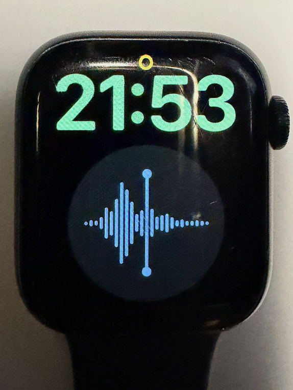

# Vorec Telegram Bot

Telegram bot that transcribes allowed users' voice messages and audio files.



## Why this exists

This bot turns quick spoken notes into reusable text. It gives an otherwise unused Apple Watch
Series 8 a second life as a dedicated voice recorder: its X-Large face has a single
Voice Memos complication, so recording an idea is a one-tap action.

The recording syncs from the watch to iCloud and then appears in Voice Memos on the iPhone. From
there it is shared to this Telegram bot, which returns a transcript. That text can be saved in
notes, turned into a GitHub issue, or used as material for a draft.

```text
Apple Watch → Voice Memos → iCloud → iPhone → Share to Telegram bot → transcript
```

The setup is especially useful for Russian-language recordings: the built-in transcription
available in the iPhone Voice Memos workflow does not cover this use case, so the bot combines
Russian-focused and general-purpose speech recognition instead.

The bot is intended primarily for Russian-language audio. Its main transcription comes
from a configurable OpenAI-compatible provider, currently Whisper through oMLX.
GigaAM provides a second, Russian-focused transcription and runs locally on Apple Silicon.

## Components

```text
Telegram → Tailscale Funnel → tailscale-ingress → bot container → GigaAM API on the Mac host
                       └→ OpenAI-compatible inference provider
```

- **Inference provider** produces the main transcription, currently with Whisper. Whisper
  can preserve English terms, anglicisms, and mixed Russian/English speech better in some
  recordings.
- **GigaAM** produces a second transcription using the existing MLX model in the oMLX
  cache. It is strong on Russian speech, but may transliterate English terms.
- **Merge model** receives both transcripts through the inference provider and combines
  their best-supported readings into one readable result. Both transcriptions are always
  made: the bot does not currently try to judge the quality of the first result.
- **oMLX** is the current local inference provider. It is not required by the architecture:
  configure any OpenAI-compatible provider with `INFERENCE_API_URL` and
  `INFERENCE_API_KEY`.
- **Docker** runs only the bot; MLX stays native on Apple Silicon.

All configuration, including API URLs and tokens, is in `.env`. Start by copying `.env.example`.

## Webhook through Tailscale

The bot receives Telegram updates through the shared `tailscale-ingress` Docker network;
it does not publish a host port. The external gateway routes
`/hooks/<Docker network alias>/...` to port 8080 of that container.

This project depends on an existing Tailscale Funnel gateway. Before starting the bot, deploy and
configure [tailscale-funnel-gateway](https://github.com/akolotov/tailscale-funnel-gateway). That
project creates the `tailscale-ingress` Docker network and exposes the shared Funnel hostname used
by `WEBHOOK_PUBLIC_BASE_URL`.

The Compose service uses the alias `vorec-telegram-bot`. Configure the following values
in `.env` (the Funnel host should match the shared gateway):

```dotenv
WEBHOOK_PUBLIC_BASE_URL=https://wabelfish-funnel.taild8e94b.ts.net
WEBHOOK_DOCKER_ALIAS=vorec-telegram-bot
WEBHOOK_PATH=/hooks/vorec-telegram-bot/telegram/webhook
WEBHOOK_SECRET_TOKEN=replace_with_a_long_random_webhook_secret
```

`WEBHOOK_SECRET_TOKEN` is sent by Telegram in a request header and is checked by the bot.
`WEBHOOK_DOCKER_ALIAS` must match the `<Docker network alias>` portion of `WEBHOOK_PATH`.
The external `tailscale-ingress` Docker network must already exist before running `manage.sh`.

## Docker build

The project deliberately has two dependency files:

- `requirements.txt` is for the local macOS environment. It includes GigaAM and MLX, which run
  natively on Apple Silicon.
- `requirements.container.txt` is for the Linux bot container. It excludes GigaAM/MLX and
  includes only the bot's runtime dependencies, including `python-telegram-bot[webhooks]` for
  the HTTP webhook server.

Keeping them separate prevents Docker from trying to install macOS-only MLX dependencies.
GitHub Actions builds and publishes the Linux image to GitHub Container Registry after changes
are merged into `main` and when version tags are pushed. `./scripts/manage.sh start` pulls the
latest published image through Docker Compose after GigaAM is ready; it does not build an image
locally.

## First setup

In a new project directory, create the local Python environment and install the macOS dependencies:

```sh
python3 -m venv .venv
.venv/bin/python -m pip install -r requirements.txt
cp .env.example .env
```

Configure `.env` with the Telegram token, allowed user IDs, API credentials, and unique webhook
settings. For a second deployment, use a different `TELEGRAM_BOT_TOKEN`,
`WEBHOOK_DOCKER_ALIAS`, and matching `WEBHOOK_PATH`.

`manage.sh` does not install dependencies. It checks that `.venv`, Docker, tmux, and the GigaAM
model directory exist before starting the services. Set `GIGAAM_MODEL_PATH` when the model is not
stored in its default oMLX cache location.

## Management

Use one script to manage both services:

```sh
./scripts/manage.sh start
./scripts/manage.sh stop
./scripts/manage.sh status
./scripts/manage.sh logs bot
./scripts/manage.sh logs gigaam
```

`start` runs GigaAM in a detached tmux session, checks its health endpoint, then starts the bot
with Docker Compose using `--pull always` and registers the Telegram webhook. This checks for a
new published image on every start without building one locally. `stop` stops the bot first and
then GigaAM.
